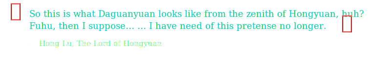
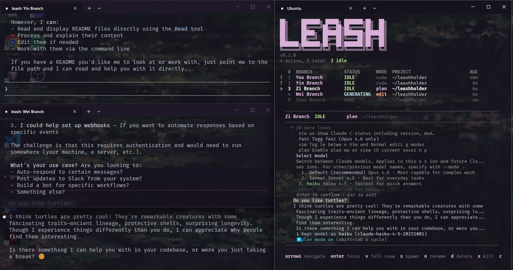

<p align="center">
  
</p>

<h1 align="center">Leash</h1>
<p align="center"></p>

<p align="center">
  
  
  
  
</p>

---

Monitor and command multiple AI CLI sessions from one place whether you're running Claude, ChatGPT, Gemini, DeepSeek, or Kimi-K2. Functionally optimized for Claude Code today, with support for other AI assistants coming in future updates. Single binary, zero runtime dependencies.

<p align="center">
  
</p>

## Features

<details>
<summary><strong>Session Management</strong></summary>

- Auto-discovery of running Claude Code sessions
- Real-time status detection (IDLE / GENERATING / DONE)
- Mode detection (code / plan)
- Named sessions with custom aliases
- Rename sessions on the fly with `leash rename`

</details>

<details>
<summary><strong>Dashboard</strong></summary>

- Live-updating session table with status, mode, project, and age
- Scrollable preview pane showing the latest output of the selected session
- Full output view with vi-style navigation
- Keyboard-driven — no mouse needed

</details>

<details>
<summary><strong>Spawn & Focus</strong></summary>

- Spawn new Claude sessions directly from the dashboard
- Windows Terminal integration — opens sessions in new WT windows
- Auto-detects your Windows Terminal profile
- Named Windows Terminal windows for easy identification
- Focus any session's terminal window by pressing Enter

</details>

<details>
<summary><strong>Monitoring</strong></summary>

- Tails session log files in real time
- ANSI escape code cleaning pipeline for readable output
- GENERATING / IDLE / DONE detection from log patterns
- 2-second polling interval for responsive updates

</details>

<details>
<summary><strong>Cleanup</strong></summary>

- `leash clean` removes session files for dead or finished processes
- Automatic dead-process detection
- Clean from the dashboard with a single keypress

</details>

## Install

```bash
git clone https://github.com/Nyrrine/leashholder.git
cd leashholder/
go build -o leash .
sudo cp leash /usr/local/bin/
```

Requires **Go 1.24+** to build. The output is a single static binary.

## Commands

- **`leash`** -- Opens the live-updating TUI dashboard
- **`leash spawn [dir] [--name <name>] [-- claude-args...]`** -- Opens a new Windows Terminal window with a Claude session
- **`leash rename <id> <name>`** -- Rename a session
- **`leash clean`** -- Removes session files for dead/finished processes
- **`leash worker`** -- Internal; runs inside spawned windows (don't call directly)

## Keybindings

### Dashboard

| Key | Action |
|-----|--------|
| `Up` `Down` | Navigate between sessions |
| `Enter` | Focus the selected session's terminal window |
| `v` | Open full output view for the selected session |
| `PgUp` `PgDn` | Scroll the preview pane |
| `s` | Spawn a new Claude session |
| `c` | Clean finished sessions |
| `q` | Quit |

### Full Output View

| Key | Action |
|-----|--------|
| `Up` `Down` / `j` `k` | Scroll one line |
| `PgUp` `PgDn` | Scroll one page |
| `Home` `End` | Jump to top / bottom |
| `r` | Refresh content |
| `Esc` / `q` | Back to dashboard |

## Documentation

- [Architecture](docs/architecture.md) -- How Leash works under the hood
- [Troubleshooting](docs/troubleshooting.md) -- Common issues and fixes
- [Contributing](docs/contributing.md) -- How to build, hack on, and contribute to Leash

## License

MIT — see [LICENSE](LICENSE). Free for anyone to use.

---

<p align="center">
  
</p>
